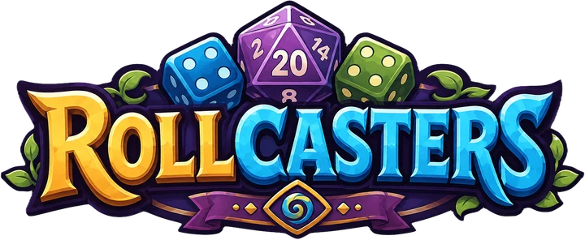

# Rollcasters

**Roll. Fight. Collect.**

Rollcasters is a creature-collecting, dice-driven strategy game. Build a squad of Critters, pair them with a powerful Rollcaster, and venture into Dungeons where every Mana roll shapes the turn ahead.

## What is a Rollcaster?

A Rollcaster is the heart of your team. Each one brings its own progression and magical Abilities to battle, while your Critters provide the Skills, stats, Elements, and tactical choices that decide each encounter.

Together, they form a loadout you can tune around different opponents and Dungeon challenges.

## The adventure

Your journey begins by choosing a starter Rollcaster and Critter. From there, the game revolves around a simple loop:

1. Build your squad and equip Skills, Abilities, and Relics.
2. Enter a Dungeon and roll Mana Dice for the turn.
3. Choose attacks, defensive actions, and swaps for your active Critters.
4. Defeat encounters to earn currency, experience, shards, and collectible drops.
5. Strengthen your collection and prepare for tougher expeditions.

## Features

- **Creature collecting** — Discover Critters with distinct Elements, stats, Skills, and progression paths.
- **Rollcaster progression** — Unlock and equip new Abilities as your active Rollcaster gains levels.
- **Dice-driven combat** — Each Mana roll creates a different action economy and asks you to adapt your plan.
- **Tactical squads** — Balance attacks, blocking, swapping, targeting, status effects, and elemental matchups.
- **Custom loadouts** — Equip Critter Skills and Relics alongside Rollcaster Abilities.
- **Dungeon expeditions** — Battle through regular and boss encounters with persistent rewards and encounter results.
- **Collectible challenges** — Complete authored goals to unlock new Critters, Rollcasters, and Relics.
- **Shops and rewards** — Spend earned currency on Critter Shards and Relics, and claim special Promo Code rewards.
- **Persistent accounts** — Your collection, progression, loadouts, currencies, and challenge progress stay with your account.

## Your collection

The Collection is more than a gallery. It shows what you own, what remains locked, and the challenges that lead to each unlock. Critters, Rollcasters, and Relics have dedicated views with their artwork, progression, effects, and collectible IDs.

Duplicate Critter and Rollcaster rewards become shards, while Relics can be collected up to their individual ownership limits.

## Current state

Rollcasters is in active development. The playable build includes account onboarding, starter selection, squad and equipment management, collection challenges, shops, Promo Codes, Dungeon battles, combat rewards, and persistent progression. Balance, content variety, and presentation will continue to grow as the game develops.

Created by **Patrick Marshall**. Development began in July 2026.
