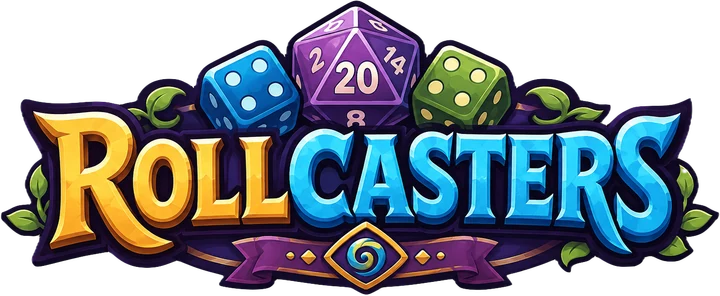

# Rollcasters

**Roll. Fight. Collect.**

Rollcasters is a creature-collecting strategy game where every turn starts with a roll. Build a squad of Critters, pair it with a powerful Rollcaster, and fight through Dungeons by turning unpredictable Mana rolls into smart decisions.

## The game

Your Rollcaster leads the team and brings magical Abilities to battle. Critters make up your squad, each with its own Elements, stats, Skills, and progression path. Relics add another layer of customization by changing how your Critters perform.

The goal is to build a collection and loadout that can handle increasingly difficult Dungeon encounters. Different opponents and challenges reward different combinations of Critters, Skills, Abilities, Relics, and Elements.

## The main game loop

1. **Choose your starters.** Begin by choosing one starting Rollcaster and one starter Critter. These choices form the foundation of your first squad.
2. **Prepare your loadout.** Fill your squad slots, select the active Rollcaster, and equip Critter Skills, Rollcaster Abilities, and Relics. You can change your loadout whenever you return to camp.
3. **Enter a Dungeon.** Choose an available expedition and review its difficulty, format, encounter count, opponents, and possible drops.
4. **Choose your leads.** At the start of each encounter, choose which healthy Critters take the active battlefield positions.
5. **Roll Mana.** Each turn, your active Critters roll Mana Dice. The result determines how much you can spend on actions that turn.
6. **Plan your actions.** Spend Mana on Skills, Blocks, and Swaps. Choose legal targets, use your Elements and effects to your advantage, and remember that some Skills or effects can alter the battle after an action resolves.
7. **Resolve the turn.** Submit your choices and watch the attacks, defenses, effects, knockouts, and swaps play out. Continue until one side wins.
8. **Press your advantage.** Clear the encounter to collect its rewards and move on. Critters begin a Dungeon at full HP but carry their wounds between encounters, so preserving your team matters.
9. **Grow stronger.** Earn Critter XP and Rollcaster XP, currencies, shards, Relics, and other drops. Use them to unlock Skills and Abilities, improve your collection, and take on tougher Dungeons.

## What you can do at camp

- **Play:** Choose a Dungeon and start an expedition.
- **Collection:** Browse owned and locked Critters, Rollcasters, and Relics. Locked collectibles show the challenges required to unlock them.
- **Bag:** View the shards, Lootboxes, and other collectible rewards you have earned.
- **Shop:** Spend earned currency on available Critter Shards, Relics, and Lootboxes, or redeem Promo Codes when you have one.
- **Challenges:** Track collectible challenges so combat progress helps you work toward new unlocks.

## Build your team

Critters are more than combat stats. Their Elements, Skills, Mana Dice, Block costs, Swap costs, and Relic slots all shape how they play. Rollcasters provide a separate progression track and a set of Abilities that can support the whole loadout.

As your collection grows, experiment with different roles and combinations:

- Use attack Skills to damage opponents and exploit elemental matchups.
- Use support Skills and Abilities to heal, strengthen allies, apply effects, or disrupt enemies.
- Block when surviving the next exchange is more valuable than dealing damage.
- Swap Critters to protect a weakened teammate or bring the right Element into play.
- Equip Relics to reinforce a Critter's strengths or cover a weakness.

## Progression and rewards

Dungeon victories award experience and authored drops. Leveling Critters and Rollcasters unlocks additional options for your loadout. Challenges can unlock new Critters, Rollcasters, and Relics, while duplicate Critter and Rollcaster rewards become shards.

Your collection, progression, currencies, loadouts, and challenge progress are saved to your player account.

## Getting started

Rollcasters requires an online connection and a player account. After signing in, choose your starter Rollcaster and Critter, configure your first squad, and select **Play** to begin your first Dungeon expedition.

Rollcasters is in active development. The playable game and its collection of Dungeons, Critters, Rollcasters, Skills, Relics, challenges, and rewards will continue to expand.

Created by **Patrick Marshall**.
